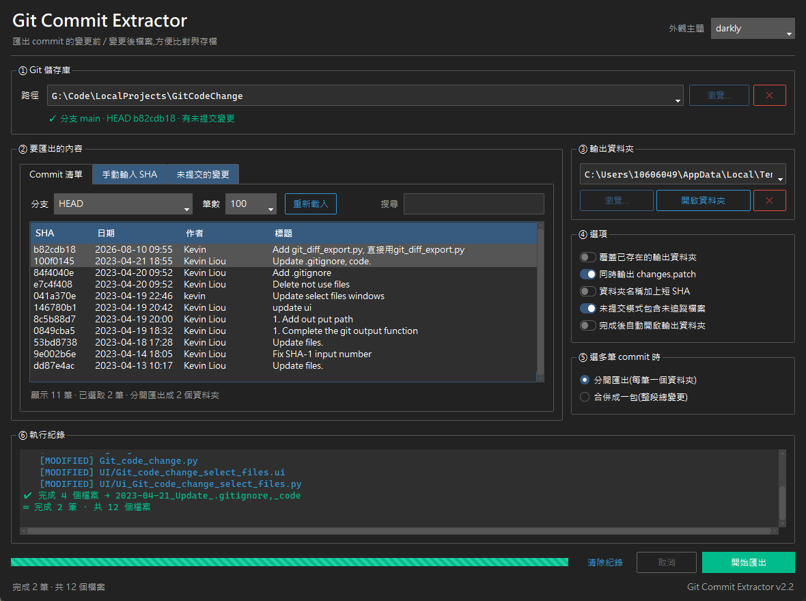

# Git Commit Extractor

把指定 commit(或工作區尚未 commit 的變更)所異動到的檔案,依「變更前 / 變更後」兩份完整檔案匯出到資料夾,方便直接丟給 Beyond Compare、WinMerge 之類的工具比對,或是打包交付、留存紀錄。

不是產生一份 diff 文字檔,而是**把整個檔案的前後版本各留一份**,連目錄結構一起還原。



---

## 環境需求

| 項目 | 需求 |
| --- | --- |
| 作業系統 | Windows(macOS / Linux 也可執行,開啟資料夾的行為會自動切換) |
| Python | 3.8 以上(開發環境為 3.11) |
| 套件 | `ttkbootstrap` **1.x**(不可用 2.x)、`GitPython` |
| 其他 | 系統需裝有 `git` 指令(GitPython 與 `changes.patch` 都會用到) |

安裝套件:

```powershell
py -m pip install -r requirements.txt
```

> **ttkbootstrap 必須是 1.x。** 直接 `pip install ttkbootstrap` 會裝到 2.x,
> 開啟時會出現 `ModuleNotFoundError: No module named 'ttkbootstrap.tooltip'`。
> 原因是 2.0 把 `ToolTip` 搬到 `ttkbootstrap.widgets`,而且 `darkly`、`cyborg`
> 這些主題名稱預設不再註冊。若已經裝到 2.x,執行:
>
> ```powershell
> py -m pip install "ttkbootstrap>=1.5,<2.0"
> ```
>
> 從 v2.4 起,套件缺失或版本不符時會跳出說明視窗並附上修正指令,
> 不會再直接丟出 traceback。

## 執行

```powershell
python git_diff_export.py
```

---

## 介面說明

### ① Git 儲存庫

* 路徑欄位是**下拉式選單**,會記住用過的儲存庫,可直接挑選,也可以手動輸入或貼上。
* 按 `瀏覽…` 選資料夾;按 `✕` 把目前這筆路徑從歷史紀錄中移除。
* 路徑輸入後會即時驗證,顯示分支、HEAD、工作區是否有未提交變更。
* 驗證成功會自動載入 commit 清單與未提交檔案清單。

### ② 要匯出的內容(三種模式)

| 分頁 | 用途 |
| --- | --- |
| **Commit 清單** | 直接從清單挑 commit。可切換分支、調整載入筆數、用關鍵字搜尋(SHA / 作者 / 標題),按住 `Ctrl` / `Shift` 可複選多筆一次匯出;連按兩下可在執行紀錄看到完整 commit 訊息。 |
| **手動輸入 SHA** | 貼上一或多筆 SHA、分支名或 tag,以空白、逗號或換行分隔。 |
| **未提交的變更** | 匯出工作區目前尚未 commit 的內容(含已 `git add` 的部分)。清單可**複選要匯出哪些檔案**,見下方說明。 |

**未提交的變更 — 挑選檔案(v2.4 起)**

清單以表格呈現(狀態 / 檔案路徑),可用 `Ctrl` / `Shift` 複選,或用「全選」「全不選」按鈕:

* **有選取** → 只匯出選中的檔案。適合工作區混著一堆 `.cache`、暫存檔,只想撈其中幾支的情況。
* **未選取** → 維持舊行為,匯出全部(此時才受「未提交模式包含未追蹤檔案」選項影響)。
* 選取的檔案**優先於**「未提交模式包含未追蹤檔案」選項:即使該選項是關的,只要在清單裡選了 untracked 檔案就會匯出。
* 按「重新檢查」重讀清單時,仍存在的選取項目會被保留。
* `changes.patch` 會**跟著只包含選取的檔案**,與 `ORG` / `MOD` 一致;若選到的全是 untracked 檔案,則不產生 patch(untracked 本來就不在 diff 裡)。
* `commit_message.txt` 會多一行 `Scope: selected files only (N picked)` 標示這是部分匯出。

### ③ 輸出資料夾

* 同樣是**下拉式選單**,記住用過的輸出路徑。
* `瀏覽…` 選資料夾、`開啟資料夾` 直接開檔案總管、`✕` 移除該筆歷史紀錄。
* 路徑不存在時,按下「開始匯出」會自動建立。

### ④ 選項

| 選項 | 說明 | 預設 |
| --- | --- | --- |
| 覆蓋已存在的輸出資料夾 | 關閉時遇到同名資料夾會略過。開啟時只會覆蓋「本工具產生的」資料夾(必須含 `ORG` / `MOD` / `commit_message.txt`),否則一樣略過,避免誤刪。 | 關 |
| 同時輸出 changes.patch | 以 `git diff` 產生 unified diff 檔。 | 開 |
| 資料夾名稱加上短 SHA | 資料夾後面補上 8 碼 SHA,避免同日期、同標題的 commit 互相衝突。 | 關 |
| 未提交模式包含未追蹤檔案 | 把 untracked 檔案也複製到 `MOD`。**只在未提交清單「沒有選取任何檔案」時生效**;有選取時以選取結果為準。 | 開 |
| 完成後自動開啟輸出資料夾 | 匯出結束自動開啟檔案總管。 | 關 |

### ⑤ 選多筆 commit 時

選超過一筆 commit 時,決定要怎麼輸出:

| 模式 | 行為 |
| --- | --- |
| **分開匯出(每筆一個資料夾)** | 預設。選幾筆就產生幾個資料夾,每包各自是「該 commit 相對於它前一筆」的變更。 |
| **合併成一包(整段總變更)** | 把整段當成一次修改:`ORG` 是**最舊 commit 的前一版**,`MOD` 是**最新 commit 之後的版本**,中間改來改去的過程會被壓平。等同 `git diff <最舊>^ <最新>` 的結果。 |

合併模式的細節:

* 頭尾是依 **commit 的父子關係**判斷,不是看時間,所以 rebase / cherry-pick 過、或同一秒內建立的 commit 也不會弄反。
* 選取有跳號時(例如只選了 C1 和 C3,中間的 C2 沒選),會跳出確認視窗告訴你這段範圍實際包含幾筆、有幾筆沒被選到——**沒選到的那幾筆變更一樣會被合併進來**,因為範圍匯出本來就是頭尾兩個版本相減。
* 選到**不同分支**上的 commit 無法合併,會直接擋下來並提示改用分開匯出。
* 只選一筆時,自動退回一般的單筆匯出。
* 中間互相抵銷的修改(改了又改回來)不會出現在結果裡,這正是合併模式的用意。

### ⑥ 執行紀錄

依狀態上色:`ADDED` 綠、`DELETED` 紅、`MODIFIED` 藍、`RENAMED` 黃。匯出在背景執行緒進行,過程中介面不會卡住,可隨時按「取消」中止。

---

## 輸出結構

```
<輸出資料夾>/
└─ 2025-05-13_Fix_SMBIOS_type9_length_a1b2c3d4/
   ├─ ORG/                     變更前的檔案(原始版本,保留原目錄結構)
   │  └─ Silicon/Smbios/Type9.c
   ├─ MOD/                     變更後的檔案(修改版本)
   │  └─ Silicon/Smbios/Type9.c
   ├─ commit_message.txt       commit 資訊 + 變更檔案清單
   └─ changes.patch            unified diff(可關閉)
```

資料夾命名規則:

| 模式 | 命名 |
| --- | --- |
| 單筆 commit | `YYYY-MM-DD_<commit 標題>`,勾選短 SHA 後再加 `_<短 SHA>` |
| 合併多筆 | `YYYY-MM-DD_<最新 commit 標題>_merged<筆數>`,勾選短 SHA 後再加 `_<最舊>-<最新>` |
| 未提交變更 | `YYYY-MM-DD_HHMM_uncommitted` |

合併模式的 `commit_message.txt` 會多列出範圍與被合併的每一筆 commit:

```
Range:   0ad78f1c..4d48b5bf
Commits: 3

Merged commits (oldest → newest):
  14ea2d43  2025-05-11 18:51  Kevin  C1 change a
  ca3e22c5  2025-05-12 09:20  Kevin  C2 add b
  4d48b5bf  2025-05-13 14:02  Kevin  C3 change a again
```

`commit_message.txt` 範例:

```
Commit:  b82cdb189b4425d672674b3a7cd10ba57cb0d178
Author:  Kevin <kevin@example.com>
Date:    2025-05-13T09:55:50
Parent:  100f01450bb595a3a787b77f6ae34d2316c34742

Message:
Fix SMBIOS type9 length

Summary: ADDED 1, MODIFIED 7  (total 8)

Changed files:
  [MODIFIED] Silicon/Smbios/Type9.c
  [ADDED]    Silicon/Smbios/Type9.h
```

各狀態對應到的輸出:

| 狀態 | ORG | MOD |
| --- | --- | --- |
| MODIFIED | ✔ | ✔ |
| ADDED / UNTRACKED | — | ✔ |
| DELETED | ✔ | — |
| RENAMED | ✔(舊路徑) | ✔(新路徑) |

---

## 快捷鍵

| 按鍵 | 功能 |
| --- | --- |
| `Ctrl` + `Enter` | 開始匯出 |
| `F5` | 重新載入 commit 清單 |
| `Ctrl` / `Shift` + 點選 | 在清單中複選 commit |
| 連按兩下 | 顯示該 commit 的完整訊息 |

---

## 設定檔

所有設定存在 `%USERPROFILE%\.git_export_tool_config.json`,關閉視窗時自動寫入:

* `repo_history` / `out_history`:路徑下拉選單的歷史紀錄(最多 12 筆,最近用過的排最前面)
* `git` / `out` / `sha` / `branch` / `limit`:上次使用的欄位內容
* `theme`:外觀主題
* `size`:視窗大小
* `options`:各項選項的勾選狀態,含 `merge_mode`(`separate` / `merged`)

想全部重來,直接刪掉這個檔案即可。

---

## 注意事項與已知限制

本工具的主要產出是 **`ORG/` 與 `MOD/` 兩份完整檔案**;`changes.patch` 與
`commit_message.txt` 是附帶的參考資料。已知問題依此分成三類 —— **只有第一類會讓匯出的
檔案本身不正確**,其餘兩類不影響 ORG/MOD 的內容。

### ⚠️ 一、會影響 ORG/ 與 MOD/ 檔案內容

這一類要留意,因為匯出的檔案本身就是錯的。

* **smudge filter 失敗**(典型情況:專案用 git-lfs 或 git-crypt,但這台機器沒安裝,或
  LFS 物件沒下載)。該檔案會退回未轉換的原始內容,可能與其他檔案的換行符不一致。
  **這種情況會在執行紀錄中以 ⚠ 警告列出檔名**,看到就不要直接使用那個檔案。
* **submodule(gitlink)** 會被當成一般檔案匯出,內容是該 submodule 的 commit 物件,
  不是子專案的檔案。多數情況下會匯出失敗並記錄錯誤,但當該 commit 物件剛好存在於外層
  儲存庫時,會靜默產生一個看似正常的假檔案。
* **只差大小寫的兩個路徑**,在 Windows 這種不分大小寫的檔案系統上會被合併成同一個檔案,
  導致其中一個檔案遺失。要確認這次匯出有沒有踩到:

  ```bash
  git diff --name-only <base> <target> | tr 'A-Z' 'a-z' | sort | uniq -d
  ```

  有輸出就代表這批變更裡存在大小寫衝突。
* **git 版本低於 2.40** 時,`GIT_ATTR_SOURCE` 會被忽略,匯出歷史 commit 時會改用目前
  工作區的 `.gitattributes` 規則。若該檔案的規則在這之間變動過,換行符會是錯的。

### 二、只影響 `changes.patch`(ORG/MOD 仍然正確)

* 二進位檔案照樣會複製完整檔案,但 patch 內只會顯示 `Binary files differ`。**因此只要
  變更集裡含二進位檔,`changes.patch` 就無法用 `git apply` 套用**(產生 diff 時未帶
  `--binary`),而且是整份失效 —— 純文字的部分也不會套用。
* **合併模式若最舊的一筆是儲存庫的第一個 commit**,`changes.patch` 只會包含最新那一筆
  commit 的差異,與同一包的 ORG/MOD 對不起來。
* `changes.patch` 在未提交模式下**不包含 untracked 檔案**(`git diff` 的行為)。
* 沒有任何檔案變更的 commit 會產生 0 byte 的 `changes.patch`,`git apply` 會拒絕它。

### 三、只影響 `commit_message.txt`(ORG/MOD 仍然正確)

清單的分類或排序不夠精確,但檔案本身都有正確匯出。

* **未提交模式不辨識更名**:`git mv` 之後尚未 commit 的檔案會被列為 `[MODIFIED] <新路徑>`,
  舊路徑不會出現在清單裡 —— 但舊路徑的檔案仍有正常寫進 `ORG/`。已 commit 的更名在
  單筆/合併模式下能正確辨識。
* **commit 排序依 committer date**,不是依祖先關係。經過 rebase、cherry-pick、amend 或
  匯入的歷史,「oldest → newest」的順序與日期範圍可能標錯。
* git 記錄為 copy 的檔案會被標成 `[ADDED]`,但 patch 裡寫的是 `copy from/copy to`。

### 四、一般操作注意事項

* **覆蓋選項會刪除整個目標資料夾**。雖然有「必須看起來像本工具輸出」的防呆,仍建議輸出到專用資料夾,不要指到桌面或專案根目錄。
* 不會遞迴進 submodule 或 `.gitman` 子專案,只處理所選儲存庫本身。
* 路徑超過 240 字元時會自動加上 `\\?\` 前綴繞過 Windows MAX_PATH 限制。
* 合併模式匯出的是**頭尾兩個版本的差異**,不是把每筆 commit 的變更逐一疊加。範圍內沒被選到的 commit,其變更同樣會包含在內。
* 儲存庫很大時,建議把「筆數」調小一點再載入 commit 清單。
* 選儲存庫時要選到含 `.git` 的那一層,不會往上層目錄自動尋找。

### 換行符與匯出速度

* 匯出的檔案內容會**套用 checkout 時的轉換**(`git cat-file --filters`),所以在 `core.autocrlf=true` 或 `.gitattributes` 設了 `text=auto` 的儲存庫上,拿到的換行符與 `git clone` 後工作區的檔案一致,可以直接覆蓋回去而不會產生整檔差異。
* 代價是**每個檔案要跑一次 `git` 子行程**,實測約 25 ms/檔。數十個檔案的 commit 無感,500 個檔案的 commit 大約要 25 秒。這是為了換行符正確性刻意付出的成本。
* `.gitattributes` 會依**被匯出的那個 revision** 解析(透過 `GIT_ATTR_SOURCE`),所以匯出歷史 commit 時不會誤用現在的規則 —— 包含「同一個 commit 同時改了 `.gitattributes` 和檔案內容」這種 ORG 與 MOD 需要套用不同規則的情況。

---

## 版本紀錄

### v2.4

**1. 未提交的變更可以挑檔案匯出**

舊版的「未提交的變更」分頁只是一份唯讀清單,按下匯出就是整包全出。工作區裡混著 `.cache`、暫存檔、產生物時,匯出的資料夾會被塞滿不相干的檔案。

v2.4 把清單換成可複選的表格,只匯出選中的檔案;沒有選任何檔案時維持舊行為(全部匯出)。`changes.patch` 與 `commit_message.txt` 都會跟著只反映選取範圍。

**2. 套件缺失/版本不符會有明確提示**

`pip install ttkbootstrap` 現在會裝到 2.x,而 2.0 把 `ToolTip` 搬到 `ttkbootstrap.widgets`,舊版程式直接噴:

```
ModuleNotFoundError: No module named 'ttkbootstrap.tooltip'
```

v2.4 在匯入階段攔下來,改用對話框說明是版本問題並附上修正指令。同時涵蓋「ttkbootstrap 沒安裝」「GitPython 沒安裝」「系統找不到 `git.exe`」三種情況。另附 `requirements.txt` 鎖定 `ttkbootstrap>=1.5,<2.0`。

### v2.3

修正兩個會讓匯出結果不能直接使用的問題。**建議從舊版升上來**。

**1. 匯出的檔案換行符是錯的**

舊版直接讀 git 物件的原始位元組。在 `core.autocrlf=true` 或 `.gitattributes` 有 `text=auto` 的儲存庫上,git 儲存的是正規化成 LF 的內容,要到 checkout 時才轉回 CRLF —— 所以匯出的每個文字檔都是 LF,與工作區的 CRLF 不同。把 `MOD/` 覆蓋回專案,會看到**每一個檔案整檔都是差異**。

未提交模式更嚴重:`ORG/` 走 git 物件(LF)、`MOD/` 直接複製磁碟檔(CRLF),**兩邊格式不同**,拿去 Beyond Compare 對照時每個檔案都會滿江紅,等於對照功能完全失效。

v2.3 改用 `git cat-file --filters`,輸出與真實 checkout 一致;並透過 `GIT_ATTR_SOURCE` 讓 `.gitattributes` 依被匯出的 revision 解析,避免匯出歷史 commit 時誤用現在的規則。

**2. `changes.patch` 無法用 `git apply` 套用**

GitPython 取 `git diff` 輸出時預設會吃掉最後一個換行位元組,導致 patch 少了結尾換行,`git apply` 直接報:

```
error: corrupt patch at line N
```

在 CRLF 檔案上更糟 —— 被砍掉的是 `\r\n` 的 `\n`,結尾留下一個孤立的 `\r`。

v2.3 在所有取 diff 的呼叫點加上 `strip_newline_in_stdout=False`,並在寫檔時再補一道保險。

**其他**

* 轉換失敗時不再靜默改用未轉換內容,會在執行紀錄中發出警告。
* 已知限制補充說明(二進位檔的 patch、更名辨識、submodule、匯出速度等),詳見「注意事項與已知限制」。

### v2.2 以前

見 commit 紀錄。

---

## 專案檔案

| 檔案 | 說明 |
| --- | --- |
| `git_diff_export.py` | 全部程式碼(核心 + GUI),單檔即可執行 |
| `requirements.txt` | 套件版本需求(`ttkbootstrap` 鎖在 1.x) |
| `README.md` | 本說明文件 |
| `.gitignore` | 忽略清單 |

程式內部已把核心與介面分開,`extract_commit()` 與 `extract_working_tree()` 不依賴 tkinter,可以直接被其他腳本匯入使用:

```python
from git import Repo
from git_diff_export import (Reporter, extract_commit, extract_commit_range,
                            extract_working_tree)

repo = Repo(r"D:\Code\MyProject")

# 單筆
extract_commit(repo, "HEAD", r"D:\out", Reporter(), name_with_sha=True)

# 多筆合併成一包
extract_commit_range(repo, ["HEAD", "HEAD~1", "HEAD~2"], r"D:\out", Reporter())

# 未提交的變更,只挑指定檔案(selected_paths=None 代表全部)
extract_working_tree(repo, r"D:\out", Reporter(),
                     selected_paths=["src/main.c", "src/main.h"])
```

> 舊版以 PyQt5 撰寫的 `Git_code_change.py` / `Git_lib.py` / `UI/` 已移除,需要時可從 git 歷史(commit `b82cdb1` 以前)取回。
